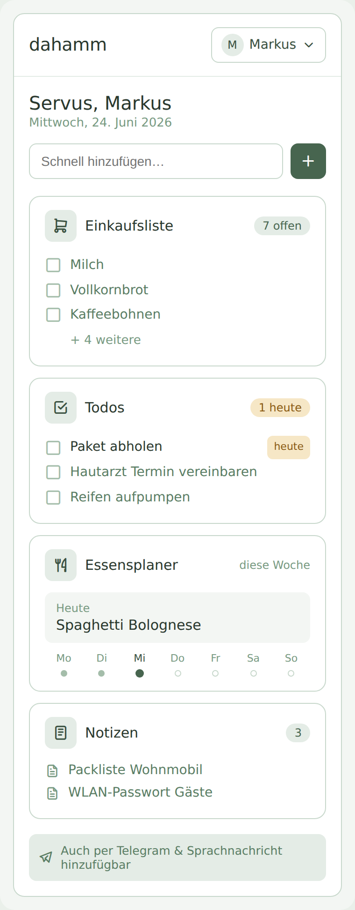

# Dahamm – CLAUDE.md

Selbst gehostete Familien-App mit Dashboard, Einkaufsliste, Essensplaner und Todos.

---

## Architektur-Überblick

```
packages/
├── app/        # SvelteKit PWA + API-Endpunkte + Auth
└── shared/     # Geteilte TypeScript-Types
```

Docker Compose, deployed auf Hetzner VPS hinter Traefik v3.

---

## Stack

| Bereich | Technologie |
|---|---|
| Frontend + API | SvelteKit (PWA-fähig) |
| Datenbank | SQLite via Drizzle ORM |
| Auth | Magic Link via nodemailer (Hetzner SMTP) |
| Deployment | Docker Compose + Traefik v3 (Hetzner VPS) |
| Monorepo | npm Workspaces (kein Nx, kein Turborepo) |

---

## Services (Docker Compose)

### `app` – SvelteKit
- Dashboard mit dem Modul: Einkaufsliste
- Auth: Magic Link per Mail (nodemailer + Hetzner SMTP)
- Session-Dauer: 30 Tage Cookie
- SQLite-Datei liegt in einem Named Docker Volume unter `/app/data/dahamm.db`

---

## UI Design

- Klar und minimalistisch, kein visuelles Rauschen
- **Mobile-first** – primäres Endgerät ist das Smartphone, Touch-Targets großzügig
- Desktop-Layout darf vorhanden sein, hat aber niedrigere Priorität
- Farbschema: gedeckte Eukalyptus-/Salbei-Palette (slate-Skala überschrieben, siehe `layout.css`), semantische Akzente nur für Status (Amber „heute", Brand-Grün für Hauptaktion)

### Icons

- **`@lucide/svelte`** (nicht das deprecated `lucide-svelte`) für alle Icons, keine handgeschriebenen Inline-`<svg>`s mehr. Farbe läuft weiterhin ausschließlich über `currentColor` + bestehende Tailwind-Textfarbklassen, keine hartkodierten Farben.
- Feste Größen-/Stroke-Konvention statt Ad-hoc-Werten pro Vorkommen:

  | Verwendung | Beispiele | `size` | `strokeWidth` |
  |---|---|---|---|
  | Primäre Buttons | `ShoppingCart`, `Plus` | `20` | `2` |
  | Sekundär (Dropdown-Indikator) | `ChevronDown` | `16` | `2` |
  | Inline-Status (klein, kräftig) | `Check` | `14` | `3` |
  | Toast-Leiticon (visueller Anker) | `CircleAlert`, `CircleCheck`, `Info` | `20` | `2` |
  | Toast-Schließen-Button | `X` | `16` | `2` |
- Keine eigene Icon-Wrapper-Komponente – bei der aktuell überschaubaren Anzahl an Vorkommen reicht die direkte `size`/`strokeWidth`-Prop-Vergabe an der jeweiligen Nutzungsstelle; eine Abstraktion erst einführen, falls sich das Muster wiederholt.

### Dashboard (Startseite `/`)

Überblicks-Seite, keine Arbeitsfläche. Aufbau von oben nach unten:

1. **Header** – App-Name links, Username-Dropdown rechts (Logout, ggf. Admin)
2. **Begrüßung** + Datum
3. **Quick-Add** – ein Eingabefeld zum schnellen Hinzufügen; ein Icon-Button links zeigt/wechselt das Ziel (Einkaufsliste, später Todos/Essensplaner), der „+"-Button rechts fügt den Eintrag direkt zum aktuell gewählten Ziel hinzu
4. **Modul-Karten** (je eine pro Modul, antippbar → Detailseite), jeweils mit Icon, Titel,
   Status-Pille (offene Anzahl) und 2–3 Zeilen Vorschau:
   - Einkaufsliste (offene Posten)

Referenz-Mockup (heller Modus, Eukalyptus): 

### Toast / Status-Hinweise

- Globale Komponente `src/lib/components/Toast.svelte` + Store `src/lib/components/toastStore.svelte.ts` (`toast.show(variant, message, durationMs?)`), einmalig in `+layout.svelte` gemountet – einzige Quelle für kurzzeitige Status-Hinweise (Error/Success/Info), löst alle Ad-hoc-Boxen ab.
- `toastStore.svelte.ts` (nicht `toast.svelte.ts`: kollidiert TS-seitig case-insensitive mit `Toast.svelte`, sobald ohne Extension importiert – `forceConsistentCasingInFileNames` schlägt plattformunabhängig zu) ist der erste modul-globale `$state`-Runes-Store im Projekt (kein Svelte-Store-API, sondern reines `$state` + Getter auf Modulebene).
- **Fallstrick:** Wird `toast.show(...)` aus einem `$effect` heraus aufgerufen (z. B. um einen Server-Fehler aus `data`/`form` zu melden), muss der Aufruf in `untrack(() => …)` (aus `'svelte'`) gewrappt werden – sonst hängt der Effect transitiv vom internen State des Stores ab (der Store liest beim Schreiben seinen eigenen Zustand) und läuft in eine Endlosschleife (`effect_update_depth_exceeded`).

---

## Authentifizierung

- **Closed App – keine anonyme Nutzung.** Jeder nicht eingeloggte Request wird auf `/login` umgeleitet. Außer der `/login`-Route, den Better-Auth-Endpoints unter `/auth/*` und statischen Assets ist nichts öffentlich erreichbar.
  - Implementierung als globaler Auth-Guard in `hooks.server.ts`: Session prüfen, sonst `throw redirect(302, '/login')`.
  - Die Login-Seite ist die de-facto-Startseite für nicht eingeloggte User; nach erfolgreichem Login geht es auf `/` (Dashboard).
  - **Ausnahme `/api/*`**: kein Redirect, sondern Bearer-Token-Check gegen den Bot-Token (siehe unten). Kein/ungültiger Token → `401 Unauthorized`.
- Im Header (nur sichtbar für eingeloggte User) steht der Username als Drop-Down-Trigger: "Logout" und – falls Admin – zusätzlich "Admin".
- Der Login erfolgt via Angabe der Mailadresse an die dann ein Magic Link geschickt wird.
- Eine Registrierung im herkömmlichen Sinne gibt es nicht – Initial ist nur der `.env`-Admin freigeschaltet, weitere User legt der Admin manuell an.
- Es gibt genau einen Admin User, dieser wird über das .env File mit Username und Mailadresse angegeben
  - Dieser Admin User ist in der DB als für den Login freigebener User aufgeführt (Whitelist) und kann sich im Login Formular anmelden
  - der Admin Boot Strap soll bei jedem Containerstart durchgeführt werden, damit der User sich nicht versehentlich aussperren kann
  - Idempotenz beim Boostrap: Upsert auf E-Mail, der Admin-Flag wird immer auf true gezwungen, alle anderen Felder bleiben unangetastet.
- das Whitelisting von Usern die sich anmelden dürfen erfolgt über Custom-Fields direkt am Better-Auth-user-Table, keine separate Whitelist-Tabelle.
- Es gibt eine Admin-Seite, auf der der Admin weitere Mail-Adressen (mit Username und Telegram User-ID) angeben kann, auch diese können sich dann in Zukunft einloggen
  - diese Admin-Seite kann nur von eingeloggten Usern aufgerufen werden, für die ein Admin Flag in der DB existiert
  - die Admin Seite erlaubt Full CRUD, also anlegen, löschen und ändern
  - Pflichtfelder beim Anlegen: **E-Mail und Username**. Telegram-User-ID ist optional (User ohne Bot-Zugriff sind erlaubt).
  - Ein Admin kann seinen eigenen Eintrag nicht löschen und sich nicht den Admin-Flag entziehen, andere Felder schon.
  - Beim Löschen eines Users werden alle seine aktiven Sessions sofort mitgelöscht (forced logout) – das Session-Cookie wird beim nächsten Request ungültig.
- **Bot-Token-Verwaltung** auf der Admin-Seite – damit der Bot-Service die `/api/*`-Endpoints aufrufen darf:
  - Genau **ein** aktiver Bot-Token zur Zeit (eigene Tabelle `bot_token`, ein Row).
  - **Generate**: erzeugt `crypto.randomBytes(32)`-hex, zeigt das Klartext-Token **genau einmal** in der UI (kopierbar), speichert in der DB nur den SHA-256-Hash + `createdAt`. Eine neue Generierung invalidiert den alten Token (Row wird ersetzt).
  - **Revoke**: löscht die Row → Bot kann nicht mehr authentifizieren, bis ein neuer Token generiert wird.
  - **Anzeige**: Status ("aktiv seit …" oder "kein Token gesetzt") plus `lastUsedAt` für Sichtbarkeit, ob der Bot den Token aktuell nutzt.
  - **Bot-Seite**: Token landet in der Bot-`.env` als `BOT_API_TOKEN`, wird bei jedem App-API-Call als `Authorization: Bearer <token>` mitgeschickt. Bot-Container neu starten nach Rotation.
  - **Hash-Vergleich**: Auth-Guard hasht den eingehenden Bearer-Token mit SHA-256 und vergleicht via `crypto.timingSafeEqual` mit dem DB-Hash. Kein Bcrypt nötig – die Tokens haben 256 Bit Entropie.
- Magic Link Flow mit Better-Auth-Plugin `magic-link`, konfiguriert mit **`disableSignUp: true`** – Better Auth legt niemals selbst User an, der einzige Weg in die `user`-Tabelle ist Admin-Bootstrap oder die Admin-Seite
  - Nutzer gibt E-Mail-Adresse ein
  - es erscheint eine Meldung, dass wenn die Mailadresse gültig ist, eine Mail gesendet wurde
  - befindet sich die Adresse nicht in der Whitelist in der DB, dann passiert nichts. Ansonsten fahre fort.
  - SvelteKit generiert signierten Token, speichert ihn in SQLite
  - nodemailer schickt Link via Hetzner SMTP. Läuft der Server lokal (dev aus $app/environment als einziger Schalter), dann wird der Magic Link in der Konsole geloggt und keine Mail gesendet, damit SMTP nicht konfiguriert sein muss
  - Klick auf Link → Session Cookie (30 Tage), Magic Link wird invalidiert
  - der Magic Link ist 24 Stunden lang gültig
- als Frameworks bzw. Infrastruktur nutze
  - Datenbank: better-sqlite3 mit der DB auf einem named Volume in der compose.yaml
  - ORM Mapper: Drizzle
  - Authentifizierung: better-auth
- **DB-Migrationen** via Drizzle Kit, automatisch beim App-Start – kein separater Deploy-Schritt
  - Schema in `src/lib/server/db/schema.ts` → `npx drizzle-kit generate` erzeugt versioniertes SQL-File in `./drizzle/`
  - Migration-Files werden committed (reviewbar im PR)
  - Boot-Reihenfolge im Container: `migrate()` → Admin-Bootstrap → SvelteKit-Server
  - Drizzle pflegt eine `__drizzle_migrations`-Tabelle, bereits angewendete Migrationen werden übersprungen (idempotent)
  - **Nicht** verwendet: `drizzle-kit push` – kein Audit-Trail, kann in Prod still destruktiv sein
- **`/login`-Route** als Heimat des Mail-Eingabe-Formulars und der Fehleranzeige – gleichzeitig die Landing-Page für nicht eingeloggte User (siehe Auth-Guard oben).
- **Rate-Limiting** über das eingebaute Better-Auth-Modul, persistiert in derselben SQLite-DB (kein Eigenbau, keine zweite Storage-Schicht):
  - pro IP auf `/sign-in/magic-link`: **5 Requests / 15 min** (Startwert, tunable) – bremst breite Enumeration und SMTP-Missbrauch
  - pro Mail-Adresse auf demselben Endpoint: **3 Requests / 1 h** (Startwert, tunable) – verhindert Flutung eines einzelnen Postfachs trotz IP-Rotation
  - alle anderen Auth-Routen: Better-Auth-Default (10 req / 10 s) reicht
  - **Hinter Traefik unbedingt** den Client-IP-Header korrekt durchreichen (`X-Forwarded-For`), in SvelteKit über `ADDRESS_HEADER` des Node-Adapters – sonst zählen alle Requests als dieselbe IP
- **Timing-Equalization gegen E-Mail-Enumeration** – Whitelist-Hit vs. Miss darf nicht über die Response-Zeit erkennbar sein:
  - **Mail-Versand fire-and-forget**: `transporter.sendMail()` nicht awaiten, sofort 200 zurück; SMTP-Fehler landen im Server-Log, nicht in der Response. Damit fällt die SMTP-Latenz (200–2000 ms) als dominanter Zeit-Faktor komplett raus
  - **Identischer Code-Pfad bei Hit und Miss**: auch bei unbekannter Mail eine Dummy-Token-Berechnung ausführen (`crypto.randomBytes(32)` + Zeitstempel, nicht persistieren); Netz-Jitter überdeckt den verbleibenden Mikro-Sekunden-Unterschied
  - **Kein** künstliches `await sleep(800ms)` – bricht, sobald SMTP langsamer wird, und kostet UX
  - Response-Text immer identisch: „Wenn die Adresse registriert ist, wurde ein Link verschickt." – egal ob Hit oder Miss
- **Magic-Link-Fehlerbehandlung beim Klick** via Better Auths `callbackURL` / `errorCallbackURL`:
  - Erfolg → Redirect zu `/`, Session-Cookie ist gesetzt, Header zeigt Username
  - Fehler → Redirect zu `/login?error=expired|invalid|used`
  - Die `/login`-Seite liest den Query-Param und zeigt über dem Formular eine Info-Box: „Dieser Link ist abgelaufen oder wurde bereits verwendet. Gib deine E-Mail erneut ein, um einen neuen zu erhalten."
  - Alle drei Error-Codes zeigen denselben Text (keine Zusatz-Info für Angreifer), Unterscheidung nur im Server-Log

---

## Environment Variables

```env
# SMTP (Hetzner Mail) – in Dev nicht nötig, Magic Link wird dann in der Konsole geloggt
SMTP_HOST=mail.your-server.de
SMTP_PORT=465
SMTP_USER=
SMTP_PASS=
SMTP_FROM=dahamm@your-server.de

# App
DATABASE_URL=file:/app/data/dahamm.db
BASE_URL=https://dahamm.markdor.net   # öffentliche Basis-URL der App, dient sowohl
                                      # Better Auth (Magic-Link-Erzeugung) als auch
                                      # SvelteKit (origin / CSRF) als einzige Quelle

# Auth
AUTH_SECRET=        # zufälliger langer String (z. B. `openssl rand -hex 32`)
ADMIN_EMAIL=               # E-Mail des initialen Admin-Users (Bootstrap)
ADMIN_USERNAME=            # Username des initialen Admin-Users (nur beim ersten Anlegen verwendet)
```

---

## Konventionen

- **Sprache:** Deutsch im UI, Englisch im Code (Variablen, Funktionen, Kommentare)
- **Geteilte Domänen-Typen** liegen in `packages/shared` (`@dahamm/shared`), damit App, API-Endpunkte und Bot dieselbe Definition nutzen. Erster Typ: `ShoppingItem` – Einkaufslisten-Posten **ohne** Menge, nur `id`, `name`, `done`, `createdAt`. DB-Schema und API leiten davon ab.
  - **Domänen-Constraints als geteilte Konstanten** dort, nicht je Schicht dupliziert: `SHOPPING_ITEM_NAME_LENGTH = { min: 3, max: 64 }` ist die einzige Quelle für Web-UI (`maxlength`/Button-Freigabe), `/api/shopping`-Validierung und Bot. Die API-Spec verweist darauf, statt die Zahl zu wiederholen. Eine echte Schema-Validierung (Zod o. Ä.) kommt erst mit dem API-Endpoint – `shared` bleibt bis dahin dependency-frei.
- **Fehlerbehandlung:** Immer try/catch in Bot-Handlern, Nutzer bekommt lesbare Fehlermeldung
- **Claude Haiku** für Intent-Parsing (günstig, schnell) – kein Sonnet für diese Aufgabe
- **Kein Nx, kein Turborepo** – plain npm Workspaces reichen
- **Kein Postgres** – SQLite ist für diesen Use Case ausreichend, einfacher zu backupen
- **Named Docker Volume** für SQLite, kein Bind Mount

---

## Deployment

- Hetzner VPS mit Docker + Traefik v3
- Bestehendes Traefik-Netzwerk: `traefik` (external)
- Internes Netzwerk: `internal` (nur zwischen den drei Containern)
- TLS via Let's Encrypt (DNS-01 Challenge mit Hetzner DNS)
- App erreichbar unter `dahamm.deine-domain.de`
### Compose-Konventionen

Aufbau analog zu den App-Stacks in `C:\Users\Markus\git\vps-config`, insbesondere
`vps-config/tandoor/compose.yaml` (Multi-Service-Stack mit DB-Volume, internem
Netzwerk und Traefik). Konkret:

- **Volumes** als named external Volumes oben deklariert:
  ```yaml
  volumes:
    db:
      external: true
      name: dahamm-db
  ```
- **Netzwerke:**
  - `dahamm-internal` (intern, nicht external) – verbindet `app`, `bot`, `whisper`
  - `web: external: true` – das vorhandene Traefik-Netzwerk
- **Pro Service:** `container_name`, `restart: unless-stopped`, `image` (bzw. `build`),
  `env_file: .env`, `volumes`, `networks`, ggf. `depends_on` mit `condition: service_healthy`.
- **Labels:**
  - `docker-volume-backup.stop-during-backup=true` auf Services mit persistentem Volume
  - Traefik-Labels nach diesem Muster (nur der nach außen erreichbare Service – hier `app`):
    ```yaml
    - "traefik.enable=true"
    - "traefik.http.routers.dahamm.rule=Host(`dahamm.markdor.net`)"
    - "traefik.http.routers.dahamm.entrypoints=websecure"
    - "traefik.http.routers.dahamm.tls.certresolver=le-resolver"
    - "traefik.http.services.dahamm.loadbalancer.server.port=3000"
    ```
- **Healthchecks** für Services, von denen andere abhängen (z. B. `whisper`,
  damit `bot` erst startet, wenn STT bereit ist).
- `bot` und `whisper` hängen **nur** im `dahamm-internal`-Netzwerk, nicht in `web`.

---

## Qualität & Tooling

Aufbau analog zu `C:\Users\Markus\git\gritshot`.

### Teststrategie

- **Viele Unit-Tests, Coverage-Gate > 85 %**, wenige E2E-Tests (Playwright nur für kritische Flows).
- **Vitest** mit zwei Projekten (vgl. `gritshot/vite.config.ts`):
  - `client` – `vitest-browser-svelte` + Playwright/Chromium headless, Pattern `**/*.svelte.{test,spec}.ts`
  - `server` – Node-Environment, Pattern `**/*.{test,spec}.ts`, Server-Code (`src/lib/server/**`)
- Coverage via `@vitest/coverage-v8`, Reporter: `text`, `lcov`, `html`, `json`, `json-summary`.
- `expect: { requireAssertions: true }` aktiv – Tests ohne Assertion schlagen fehl.
- E2E via Playwright (`tests/`), nur Smoke- und Critical-Path-Tests.
- **E2E-Login via Setup-Project + `storageState`** (Playwright-Standardmuster, https://playwright.dev/docs/auth): ein `auth.setup.ts`-Project loggt sich einmal per echtem Magic-Link-Flow als der `ADMIN_EMAIL`-Testuser ein und speichert die Session in `playwright/.auth/admin.json`. Das `e2e`-Project hängt per `dependencies: ['setup']` daran und startet alle weiteren Specs (Einkaufsliste, Todos, …) bereits eingeloggt – kein Login-Boilerplate pro Testdatei.
  - **Ein geteilter Admin-Account** für alle E2E-Tests (kein Per-Worker-Isolation-Setup). Ausreichend, solange E2E auf wenige Smoke-/Critical-Path-Tests beschränkt bleibt; Per-Worker-Accounts erst nötig, falls parallel laufende Tests sich gegenseitig über geteilten Server-State stören.
  - Tests, die explizit unauthentifiziert starten müssen (Closed-App-Guard, der Login-Flow selbst), resetten den State lokal mit `test.use({ storageState: { cookies: [], origins: [] } })`.
  - Tokens werden gehasht gespeichert, das Klartext-Magic-Link landet nur in der `MAGIC_LINK_DEBUG_PATH`-Capture-Datei (Test-Seam, siehe `auth.ts`). Lokal (`test:e2e`, Vite Preview) liegt diese Datei direkt auf dem Host. Gegen den Container (`docker:test`) macht `compose.e2e.yaml` sie per Bind-Mount host-sichtbar und isoliert den Lauf zusätzlich auf ein eigenes DB-Volume (`dahamm-data-e2e`, vor jedem Lauf per `down -v` geleert) statt der echten Dev-Volume `dahamm-data`.

### GitHub Actions (`.github/workflows/ci.yml`)

Trigger: `on: push` (alle Branches) + `workflow_dispatch`. Drei Jobs, analog gritshot:

1. **`test`** – Node 24, `npm ci`, `npx playwright install --with-deps`,
   `npm run test:coverage`, `npm run test:e2e`, Coverage als Artefakt hochladen,
   PR-Kommentar via `davelosert/vitest-coverage-report-action`.
2. **`release`** – `needs: test`, nur auf `main`, `cycjimmy/semantic-release-action` mit
   `@semantic-release/git`, GitHub App Token (`CICD_CLIENT_ID` / `CICD_PRIVATE_KEY`).
   Exportiert die Outputs `new_release_published` / `new_release_version` für den
   nachgelagerten Docker-Job.
3. **`docker`** – `needs: [test, release]`, läuft **nur auf `main` und nur wenn ein neues
   Release publiziert wurde** (`needs.test.result == 'success' && github.ref == 'refs/heads/main'
   && needs.release.outputs.new_release_published == 'true'`):
   Build & Push nach `ghcr.io/markdor/dahamm-app` mit Tags `latest` / `<version>`.
   Pro Service ein eigenes Image mit `dahamm-`-Präfix (`dahamm-app`, später `dahamm-bot`,
   `dahamm-whisper`); Owner/Repo-Präfix bleibt dynamisch via `${{ github.repository }}-<service>`.

Action-Versionen sinngemäß auf aktuellem Stand pinnen (gritshot aktuell: `checkout@v6`,
`setup-node@v6`, `upload-artifact@v7`, `create-github-app-token@v3`,
`semantic-release-action@v6`, `docker/*` v4/v6/v7).

### PR ↔ Issue-Verknüpfung

`.github/pull_request_template.md` enthält eine `Closes #`-Zeile. Wird dort die Issue-Nummer eingetragen (z. B. `Closes #24`), schließt GitHub das Issue automatisch beim Merge des PRs – kein separater Workflow nötig, funktioniert nativ über GitHubs Closing-Keywords.

### Dependabot Auto-Merge (`.github/workflows/dependabot-automerge.yml`)

Eigener Workflow analog gritshot: `on: pull_request`, nur für PRs von `dependabot[bot]`.
Holt die Metadaten via `dependabot/fetch-metadata`, aktiviert Auto-Merge (squash) für
`version-update:semver-patch`-Updates (`gh pr merge --auto --squash`).

### Logging

- **pino** + **pino-pretty** (nur in Dev).
- Zentraler Logger in `src/lib/server/logger.ts`:
  ```ts
  import pino from 'pino';
  import { dev } from '$app/environment';

  export const logger = pino({
    level: dev ? 'debug' : 'info',
    transport: dev ? { target: 'pino-pretty' } : undefined
  });
  ```
- Im Bot- und Whisper-Service eigenes pino-Setup mit denselben Konventionen
  (Level via Env, JSON in Prod, pretty in Dev).

### Error Handling

- **Typisierte Fehlerklassen** mit separater `userMessage` (für UI/Telegram) und
  technischer `message` (für Logs) – Muster wie `FileValidationError`:
  ```ts
  export class ValidationError extends Error {
    constructor(message: string, public readonly userMessage: string) {
      super(message);
      this.name = 'ValidationError';
    }
  }
  ```
- **Handler-Pattern** (SvelteKit Action / Bot-Handler):
  - Validierungsfehler → `fail(422, { userMessage: e.userMessage })` bzw. lesbare Telegram-Antwort
  - Unerwarteter Fehler → `logger.error(...)` + generische User-Meldung (`fail(500, ...)`)
  - `catch (e: unknown)`, dann via `instanceof` verengen
- Niemals interne Fehlertexte oder Stacktraces an den Nutzer durchreichen.
- **`userMessage`-Vertrag in `fail()`-Payloads**: Jede generische (nicht feld-bezogene) Action-Fehlermeldung nutzt ausschließlich das Feld `userMessage` – nie interne Codes wie `'not_found'`/`'missing_id'` in einem generischen `error`-Feld. Der Client (`toastActionFailure()` in `src/lib/components/actionToast.ts`) liest `result.data?.userMessage` blind und zeigt es per Toast an, mit Fallback-Text nur wenn das Feld fehlt – es gibt also keinen Guard/Whitelist mehr auf Client-Seite, die Sicherheit kommt allein daher, dass der Server nie einen internen Code in dieses Feld schreibt.
  - **Ausnahme `fieldErrors`**: Per-Feld-Validierungsfehler (z. B. `admin/+page.server.ts`, Codes `required`/`invalid`/`taken`) bleiben ein separates Pattern – dort sind es bewusst kurze, whitelisted Codes, die client-seitig über eine feste Map (`errorText` in `admin/+page.svelte`) in Text übersetzt werden, weil sie inline am jeweiligen Feld angezeigt werden, nicht global im Toast.

Vor neuen Arbeiten in diesen Bereichen: in `gritshot` (Code) bzw. `vps-config/tandoor` (Compose)
verifizieren, ob die Konvention noch aktuell ist.

---

## CLAUDE.md Pflege

Nach jeder abgeschlossenen Feature-Implementierung:

1. Falls das Feature nicht-triviale Entscheidungen enthält (Auth-Sonderfälle, bewusste Scope-Abgrenzungen, unerwartete Constraints), als kurze Sektion in CLAUDE.md ergänzen – nur was **nicht** aus dem Code oder Git-History ableitbar ist.
2. Veraltete oder falsche Aussagen in bestehenden Sektionen korrigieren.

Zukünftige Arbeit wird ausschließlich als GitHub Issue getrackt (Titel + Stub, Refinement via `/refine`) – CLAUDE.md dokumentiert nur den bestehenden Stand und Konventionen, keine Roadmap.